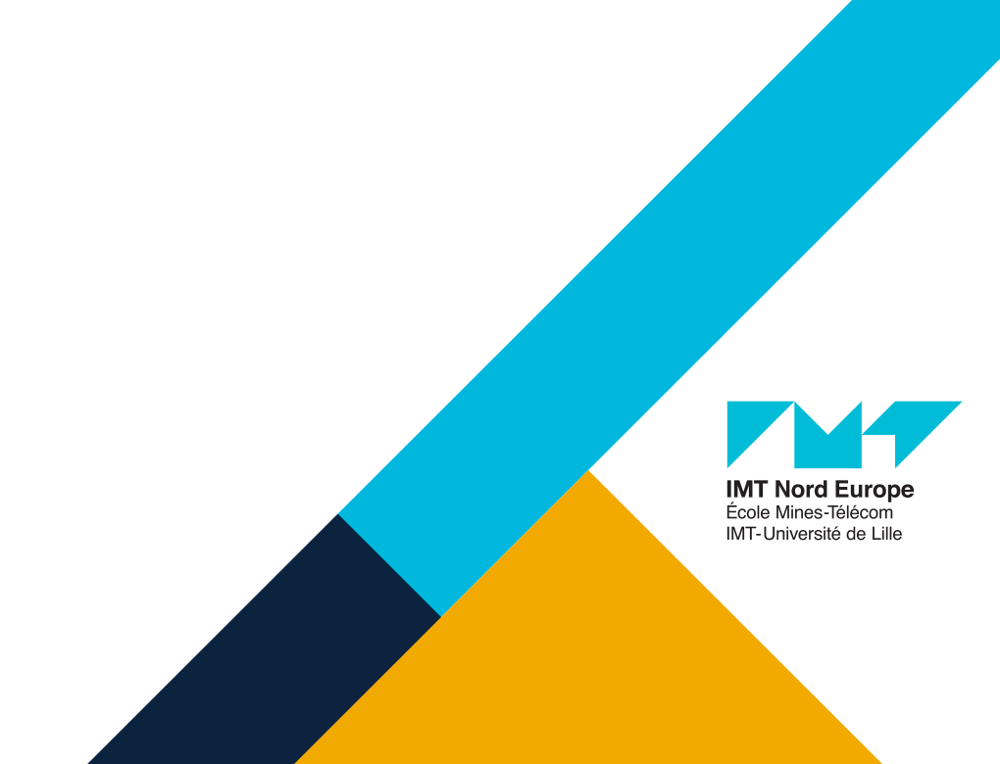

# Spécialité LoDSC
### Logiciel et Décision     pour les Systèmes Complexes

 
 
 

**guillaume.lozenguez**
**jerry.lonlac**
[@imt-nord-europe.fr](mailto:guillaume.lozenguez@imt-nord-europe.fr)

---
<!-- --------------------------------------------------------------- -->

 

- **Parcours RAISE**
- **Spécialité LoDSC**
- **UV LoDI**
- **UV MAPS**

---
<!-- --------------------------------------------------------------- -->

## Placement des UVs de spécialité LoDSC 

- **LoDSC**: Logiciel et Décision pour les Systèmes Complexes

- **RAISE**: Responsible AI & data SciencE

---
<!-- --------------------------------------------------------------- -->

## Parcours RAISE - Année 1

- _CI2 - Semestre 1_ (264 Heures)
  - **UV CSN** - Socle Commun pour les Systèmes Numériques    (Data / Math. pour le numérique, Informatique)
  - **UV OSIA** - Outils pour la Science des données et l’IA
- _CI2 - Semestre 2_ (240 Heure) 
  - **UV AARES** - Apprentissage Avancé et RESponsable 
  - **UV** au choix
    - **BigData** - Gestion des grandes masses de données   et infrastructures pour le Big Data 
    - **SAFE** - Sécurité des données, Authentification   et analyse ForEnsique 

---
<!-- --------------------------------------------------------------- -->

## Spécialité LoDSC : Genèse:

- Génie Logiciel pour les systèmes distribués
  - Architectures logicielles modulaires et de service
- Modélisation et Optimisation de systèmes complexe
  - Thématique plus IA et RO
- Mariage sur les aspects Data et Industrie 
  - Industrie _>_ Un système complexe parmi d'autre :   Transport, Jeux et Simulation

_>_ Décomposition en 3 modules: 2 théoriques et 1 plus applicatif / projet. 

---
<!-- --------------------------------------------------------------- -->

## Spécialité LoDSC : Année 2 du Parcours RAISE

- **LoDI** - Logiciels Distribués et Intelligents - _Guillaume_
- **MAPS** - Modèles & Algorithmes pour l'oPtim. de Systèmes complexes   - _Jerry_
- **TIJS** - application Transport, Industrie, Jeux et autres Systèmes complexes   - _Guillaume_

Volume horaire: 96h dont 76h encadrées et 20h en autonomie.

---
<!-- --------------------------------------------------------------- -->

## Spécialité LoDSC : L'UV TIJS - El grande Final

#### S'articule autour de projets confiés aux étudiants en équipe.

**Vue étudiant:**

- Choisir un projet sur une thématique (Transport, Indus. ...)
- Assiste aux cours Thématiques
- Développe leur projet en semi-autonomie (gros des heures)

**Vue Profs:**

- Propose des sujets
- Orchestre la conduite de projet
- Propose des cours thématiques et se partage le suivi

---
<!-- --------------------------------------------------------------- -->

## Spécialité LoDSC - Point dure

### Les 2 UVs "Notions"

- **UV LoDI** - Logiciels Distribués et Intelligents
  - IA et Géni Logiciel
  - Modélisation et Simulation à Base d’Agents
  - de l'Acquisition au Traitement de dOnnée en Milieu contraint
- **UV MAPS** - Mod. Algo. Opim
  - Formalisation et résolution de problèmes
  - Techniques de résolution de problème :   optimisation combinatoire, solveurs
  - Modélisation et contrôle de systèmes dynamiques

---
<!-- --------------------------------------------------------------- -->

## Spécialité LoDSC - Point dure

### Mission aujourd'hui - Construire les modules.

- Détailler les notions
- Identifié un responsable et des intervenants

---
<!-- --------------------------------------------------------------- -->

## L'UV LoDI - Logiciels Distribués et Intelligents

- GénIAD - Géni Logiciel pour des IAs Distribués
  - _Architecture logiciel modulaire et de services._
  - **Luc**, Noury, Guillaume
- MeSBAs - Modélisation et Simulation à Base d’Agents
  - _L'agentifcation au service de la modélisation de système complexe_
  - **Arnaud**, Guillaume, (Noury)
- ATOM - de l'Acquisition au Traitement de dOnnée en Milieu contraint
  - _l'algorythmie Embarquée (au sens hardware et environnement cible)_
  - **Jacques**, Luc

 

env. $30 h$ par modules.

---
<!-- --------------------------------------------------------------- -->

## L'UV MAPS - Modèles & Algorithmes pour l'oPtimisation de Systèmes complexes

- Formalisation et résolution de problèmes
  - _de l'énoncé à la définition formellement un problème._
  - Jerry, Arnaud, Flavien
- Techniques de résolution de problème : optimisation combinatoire, solveurs
  - _Ouvrir la boîte. Combiner les techniques._
  - Jerry, Flavien, Jérémie
- Modélisation et contrôle de systèmes dynamiques
  - _théorie des jeux, recherche arborescente et incertitude_
  - Guillaume, Franck, Jérémie

 

env. $30 h$ par modules.